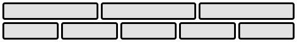
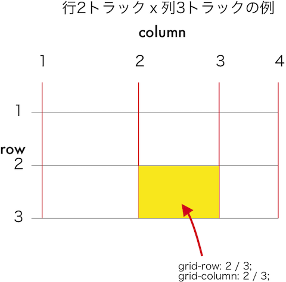

# Grid Layout

Grid Layoutは、Boxesとsizingと配置を制御するCSSの新しいレイアウトモデルです。

[CSS Grid Layout Module Level 1](https://www.w3.org/TR/2017/CR-css-grid-1-20171214/)

[使用可能なブラウザ](https://caniuse.com/#feat=css-grid)

## 用語

まず覚えること。
1. コンテナ：グリッド全体を囲む要素
2. アイテム：コンテナの直接の子要素
3. ライン：グリッドを作る線
4. トラック：行と列のこと。行トラック、列トラック
5. セル：アイテムを配置する枠
6. エリア：アイテムを配置する枠

## 使い方

サンプルのCSSコード参考
全体のグリッドのサイズはコンテナ（親要素）に記述する。
1. コンテナに対してここにグリッドを作ると宣言する。  
具体的には、`display: grid;`とするだけ。
2. コンテナに対して、トラックのサイズを決める。  
  * grid-template-rows: 行のトラックの高さを半角スペースで区切って指定
  * grid-template-columns: 列のトラックの幅を半角スペースで区切って指定
  * frというのは「余った幅」と考える

これで枠組みができるので、あとはそれぞれのアイテムをどこの枠に落とし込むかを決めていく。
この設定はそれぞれのアイテム（直接の子要素）に対して行う。

* grid-row: アイテムが占める行のラインの番号をスラッシュ区切りで指定する
* grid-column: アイテムが占める列のラインの番号をスラッシュ区切りで指定する

